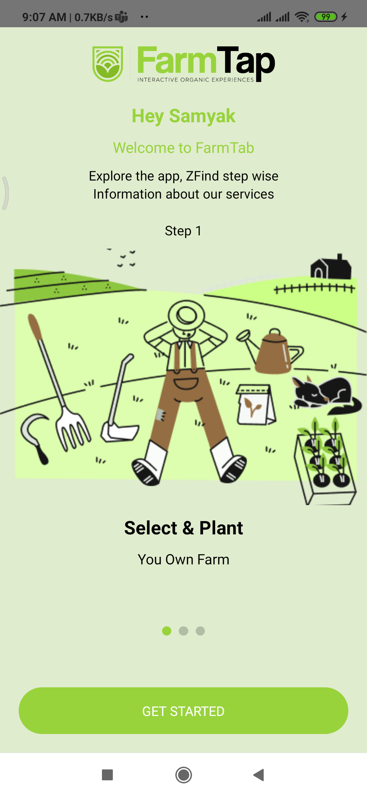
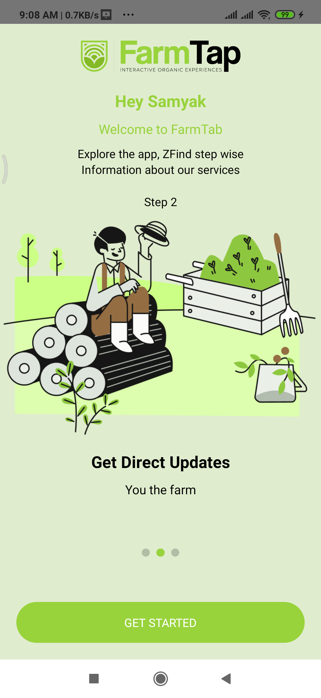
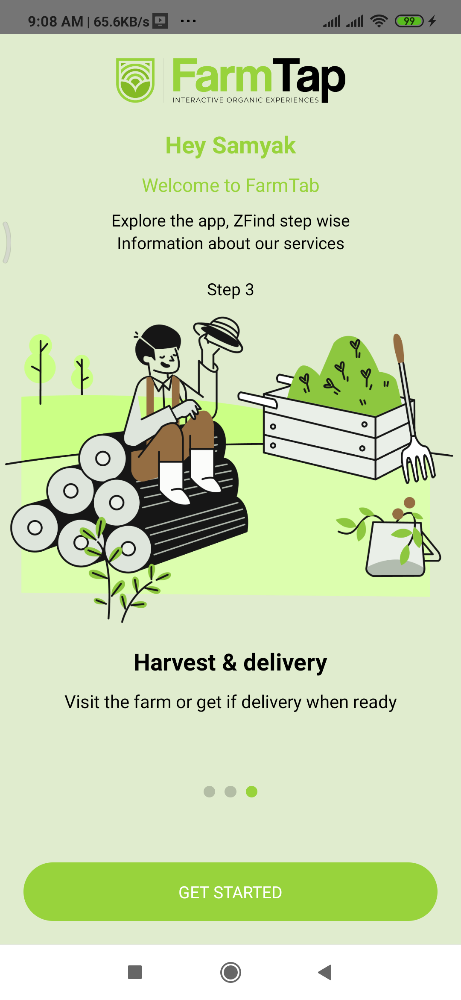
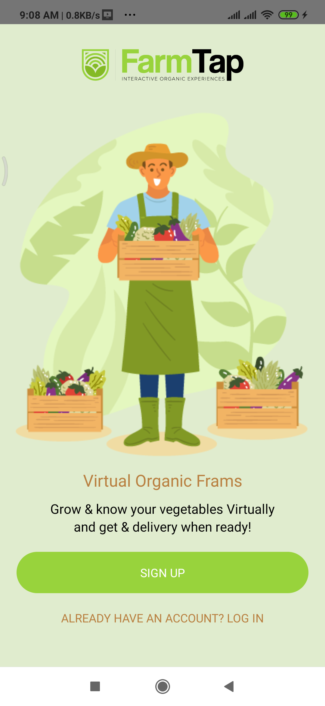
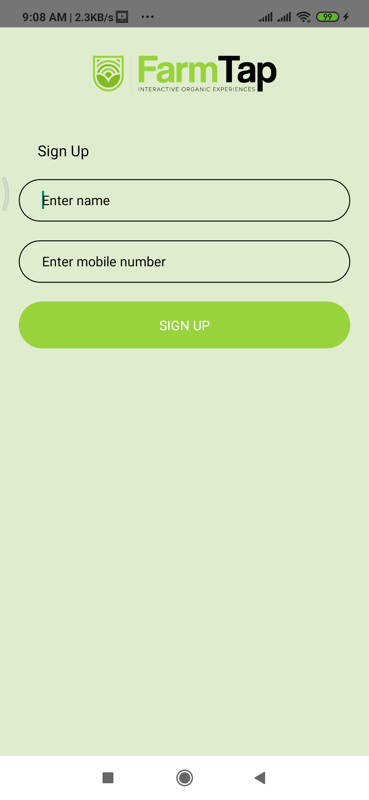

# FarmTap
 FarmTap

 Starting AppIntroSlider, Welcome screen and mobile number authentication with firebase.
 

 In this tutorial, we'll make a simple mobile number verification in authentication with firebase.
  

 

    
                                         
    
                                         
     

     

                                                                                                
Running the project

 
Assuming you have all the requirements installed, you can setup and run the project by running:

yarn or npm install to install the dependencies
run the following steps for your platform

Android

only the first time you run the project
yarn or npm start to start the metro bundler, in a dedicated terminal
yarn android to run the Android application (remember to start a simulator or connect an Android phone)

IOS

cd ios pod install to install pod dependencies cd .. to come back to the root folder yarn or npm start to start the metro bundler, in a dedicated terminal yarn ios to run the iOS application (remember to start a simulator or connect an iPhone phone)
